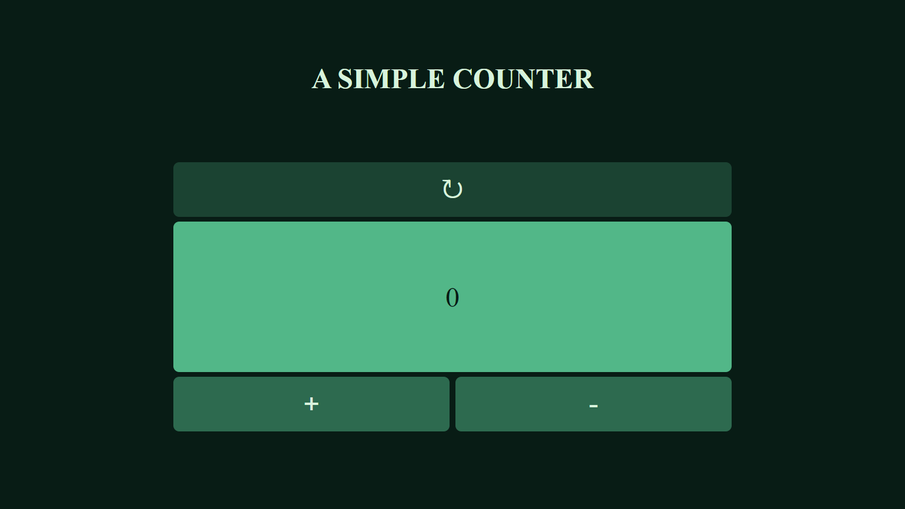

# A simple Counter made in JavaScript

This application allows you to decrease, increase or reset the value of the counter. [Try it here!](https://a-simple-counter-9.netlify.app/)

## Minimal Design

I chose this design because it's user friendly, with only 3 buttons we have all we need in a basic counter to work.

## Authors

- [Linkedin](https://www.linkedin.com/in/michelemaioli)
- [Website](https://mic-9.github.io/)

## License 

[MIT](https://choosealicense.com/licenses/mit/)

